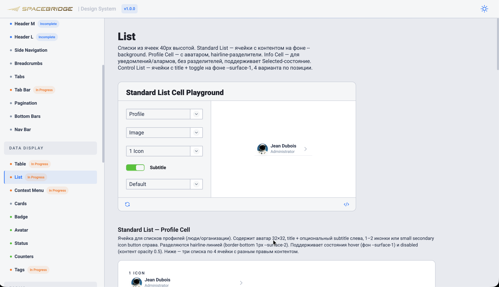
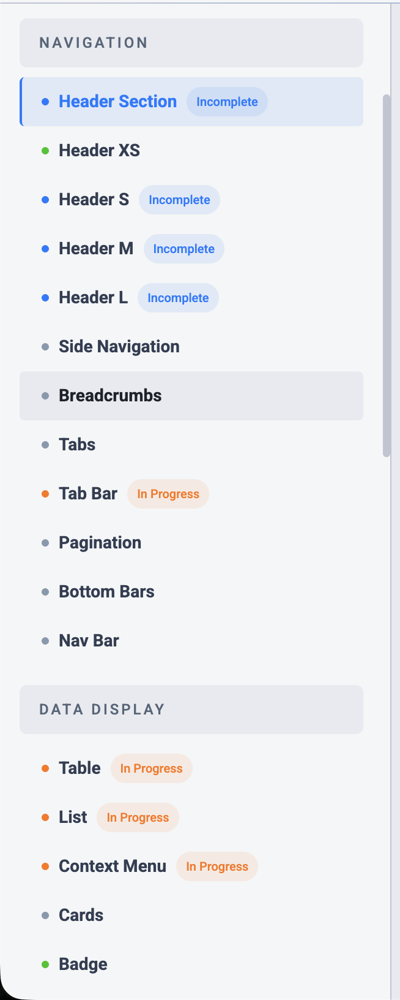
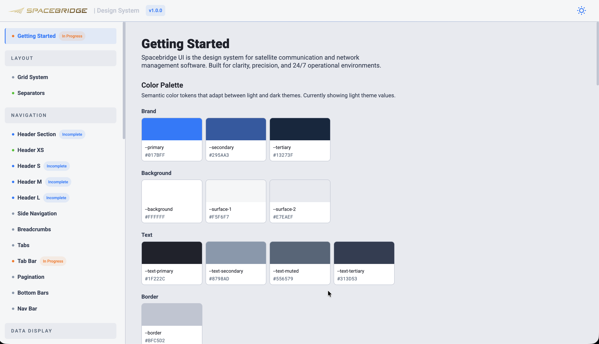
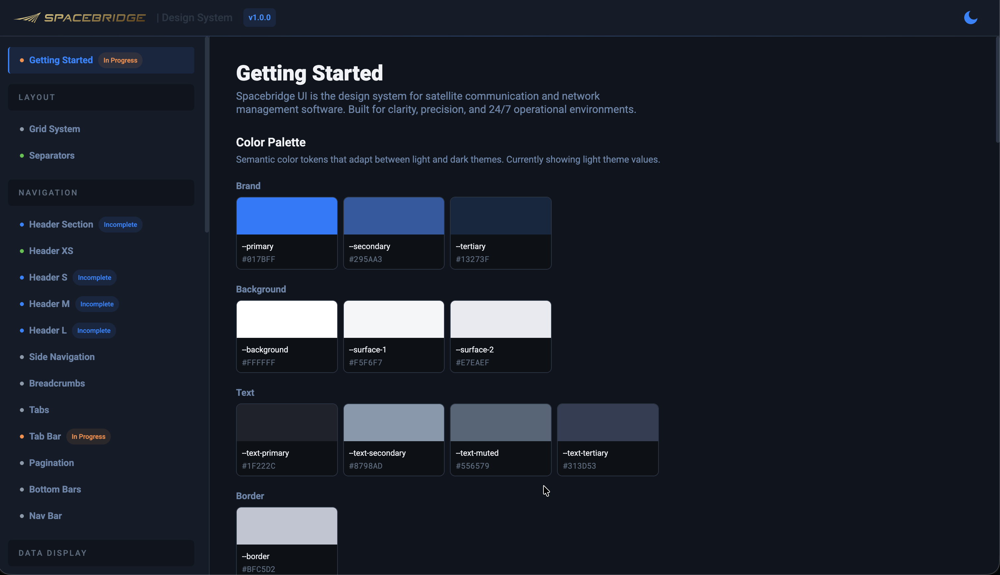
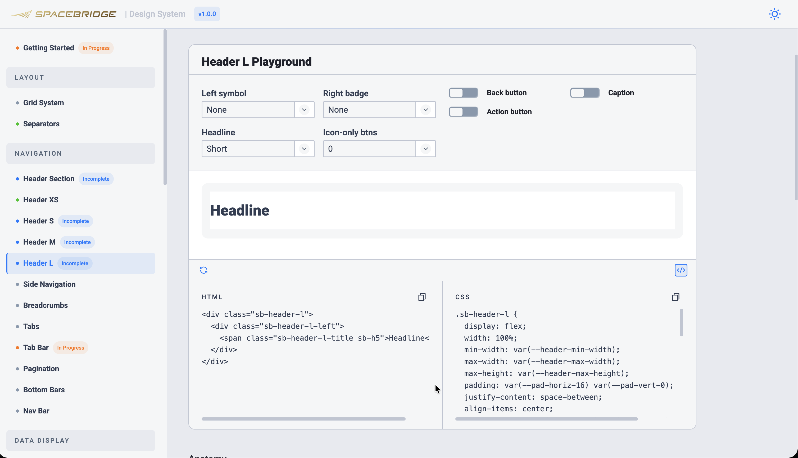

# Spacebridge Design System

> Internal design system supporting [SpaceBridge Inc.](https://spacebridge.com/about-us/) GUI products with a unified visual language and a shared component architecture.

[](#status)
[](LICENSE)
[](#tech-stack)

**Live preview:** _coming soon_ — `https://susheme.github.io/Spacebridge-DS/`



---

## About

Spacebridge DS is the single source of truth for UI components, color tokens, typography, spacing, and interaction patterns used across SpaceBridge's GUI products. It exists to:

- **Speed up delivery.** New components and revisions land in one place; designers and developers consume them from the same source.
- **Keep the GUI consistent.** Every product in the portfolio shares the same building blocks, the same tokens, and the same behavior.
- **Stay live and copy-paste-ready.** Each component ships with its rendered preview, raw HTML, and CSS — directly copyable into any front-end project.

The system is built and maintained for **internal use** by SpaceBridge's front-end engineers and designers. The repository is open so it can serve as a reference and a template for similar internal design systems.

## Status

**Alpha.** Functional and demonstrably useful, but not yet feature-complete.

Each component in the sidebar carries one of four status badges:

| Badge | Meaning |
|---|---|
| `Ready` | Finalized — safe to use as-is |
| `Incomplete` | Functionally done — awaiting visual polish or edge-case work |
| `In Progress` | Under active construction — expect breaking changes |
| _(none)_ | Planned, not yet implemented |



## Roadmap

- **Next month** — finalize the remaining standard and custom components (forms, feedback, navigation cluster).
- **Following month** — adapt component code to **Angular** for direct integration into SpaceBridge production front-ends.

## Tech stack

- **Vanilla JavaScript** — no framework, no bundler, no build step.
- **Plain CSS** with custom properties for tokens.
- **`file://`-compatible** — opens in any browser without a local server.
- **Single-page application** with hash routing.
- **Live code panels** powered by an in-house playground runtime (`SB_PG`).

The only runtime dependency is **JSZip**, loaded from a public CDN for the multi-theme SVG export feature.

## Quick start

```sh
git clone https://github.com/susheme/Spacebridge-DS.git
cd Spacebridge-DS
open index.html       # macOS
xdg-open index.html   # Linux
start index.html      # Windows
```

That is the complete setup. No `npm install`, no build step, no watch process. Edit any file under `js/components/` or `css/components/` and refresh the page.

> **Tip.** For a fully featured experience (e.g. clipboard write API in some browsers), you can serve the directory via any static server, for example `python3 -m http.server 8000`.

## Project structure

```text
Spacebridge-DS/
├── index.html                  # Single entry point — links every CSS/JS file
├── css/
│   ├── tokens.css              # Non-color tokens (radii, spacing, typography)
│   ├── typography.css          # sb-* type classes (sb-h1…sb-h8, sb-body-*, sb-caption…)
│   ├── layout.css              # App shell (topbar, sidebar, content)
│   ├── playground.css          # Playground card / controls / preview
│   └── components/<name>.css   # One file per component, SYNC blocks
├── js/
│   ├── core.js                 # Sidebar NAV, icon paths, registry, playground runtime
│   ├── tokens.js               # Color tokens (single source of truth, injected as CSS vars)
│   ├── docs-helpers.js         # Code panel, copy-to-clipboard, theme toggle
│   ├── init.js                 # Bootstrap
│   └── components/<name>.js    # One file per component
├── Icons/                      # SVG icon paths, source files (size-S / size-L)
├── Symbol-Badges/              # Status / system badge SVGs
├── Figma Tokens/               # Source-of-truth JSON exports from Figma
├── docs/screenshots/           # Screenshots used in this README
├── CONTRIBUTING.md             # Designer-facing contribution guide (RU)
├── CLAUDE.md                   # AI-tooling rules (RU)
├── LICENSE                     # Apache 2.0 license text
├── NOTICE                      # Copyright + trademark notice
└── README.md                   # This file
```

## Tokens

Spacebridge DS treats the Figma export as the **single source of truth**. A token is added to the codebase only when it exists in the corresponding Figma JSON; nothing is improvised.

- **Color tokens** live in [`js/tokens.js`](js/tokens.js) (`COLOR_TOKENS` array). They are injected as CSS custom properties at runtime, so theme switching works without recompiling stylesheets.
- **All other tokens** (radii, border widths, padding, gap, font sizes / weights / line-heights, component dimensions) live in [`css/tokens.css`](css/tokens.css).
- **Source files:** [`Figma Tokens/`](Figma%20Tokens/) (Color, Dimensions, Typography).

The same semantic tokens drive both light and dark themes — a runtime toggle in the topbar swaps the values without recompiling stylesheets.

| Light theme | Dark theme |
| :---: | :---: |
|  |  |

## Components

Every component is registered through `sbRegister(...)` in `js/components/<name>.js`, with a parallel `css/components/<name>.css` style sheet wrapped in `[SYNC:<key>]` markers. The current inventory is rendered in the sidebar at runtime; this README mirrors it for offline reference.

### Layout
- Grid System
- **Separators** — _Ready_

### Navigation
- **Header Section** — _Incomplete_
- **Header XS** — _Ready_
- **Header S** — _Incomplete_
- **Header M** — _Incomplete_
- **Header L** — _Incomplete_
- Side Navigation
- Breadcrumbs
- Tabs
- **Tab Bar** — _In Progress_
- Pagination
- Bottom Bars
- Nav Bar

### Data Display
- **Table** — _In Progress_
- **List** — _In Progress_
- **Context Menu** — _In Progress_
- Cards
- **Badge** — _Ready_
- **Avatar** — _Ready_
- **Status** — _Ready_
- **Counters** — _Ready_
- **Tags** — _In Progress_

### Forms
- **Buttons** — _Ready_
- **Chevron Button** — _Ready_
- **Input** — _Ready_
- **Textarea** — _Ready_
- **Password Input** — _Ready_
- **Search Bar** — _Ready_
- **Selectors / Dropdowns** — _In Progress_
- Chips
- **Toggles** — _Ready_
- **Checkbox** — _Ready_
- **Radio** — _Ready_
- Sliders
- File Uploader

### Feedback
- **Notifications** — _In Progress_
- Toast
- Dialogues / Modals
- Loaders
- Pop-Ups

### Utility
- Icons
- Tooltips
- Contextual Menu

Components are inspected in the live UI through interactive playgrounds with real-time controls and copyable code:



## Contributing

The contributor flow is described in [CONTRIBUTING.md](CONTRIBUTING.md) (RU).

For AI-assisted development (Claude / Cursor / etc.), the agent ruleset and editing boundaries are in [CLAUDE.md](CLAUDE.md) (RU).

## Authors

- [@susheme](https://github.com/susheme) — design system lead, vanilla implementation
- _Angular adaptation contributor_ — to be added with the Angular workstream

## License

Released under the [Apache License 2.0](LICENSE).

### Trademark notice

Apache 2.0 (Section 6) does **not** grant the right to use SpaceBridge trade names, trademarks, service marks, product names, or logos. Specifically, **SpaceBridge Inc. ("SpaceBridge")** retains all rights to:

- The `SpaceBridge` name and any stylized form of it
- The SpaceBridge logo (all variants)
- All SpaceBridge product names referenced in this repository

You may reuse, modify, and redistribute the source code under Apache 2.0, but you must remove or replace SpaceBridge identifying assets in any fork, derivative work, or public deployment. See [NOTICE](NOTICE) for the full statement.

For SpaceBridge's privacy practices, see the [Privacy Policy](https://spacebridge.com/privacy-policy/).
